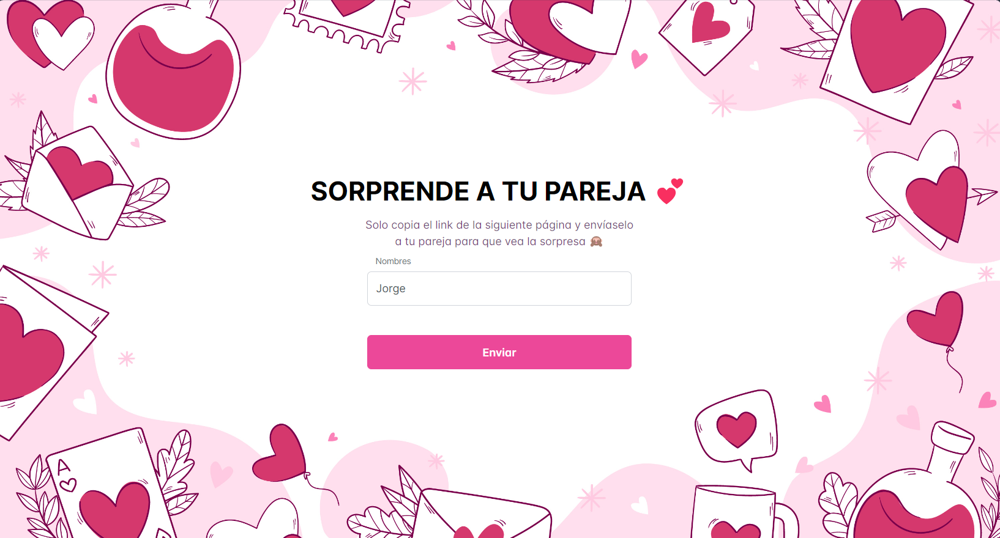
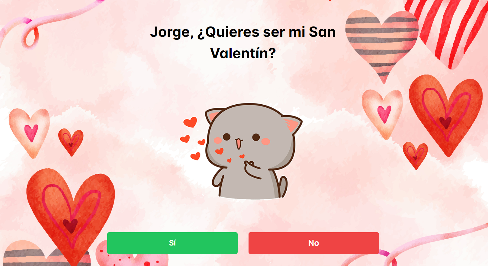

# PROYECTO DÍA SAN VALENTÍN 💕
¡Hola a todos! Este proyecto es un pequeño regalo para el día de San Valentín. Espero que les guste y que lo disfruten mucho.

## Link de la página
https://sanvalentine.pages.dev/

## ¿Qué es?
Es una página web en la que podrás ingresar el nombre de tu pareja e invitarla a que sea tu San Valentín de una manera muy especial, ya que no podrá negarse y tendrá que aceptar tu invitación 😂

## ¿Cómo funciona?
Cuando ingresas a la web, verás un pequeño formulario en el que podrás ingresar los nombres de tu pareja. Luego, al hacer clic en el botón "Enviar", te redirigirá a una página, donde deberás copiar el link y compartirlo con tu pareja para que pueda interactuar con la página.

## Ejemplo
1. Ingreso un nombre y presiono enviar
2. Me redirige a una página con un link que debo compartir con mi pareja
El link se verá de la siguiente manera: https://sanvalentine.pages.dev/v/Jorge

## Agradecimientos
Proyecto inspirado en el proyecto de [Maxsoll159](https://github.com/Maxsoll159/proyectoSanValentin). Muchas gracias por la idea y aceptar que hiciera mi propia versión.
